## 一、 前后端分离架构原理图

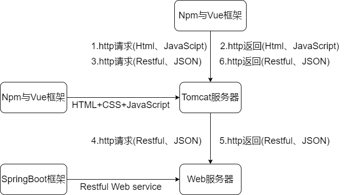

## 二、技术路线图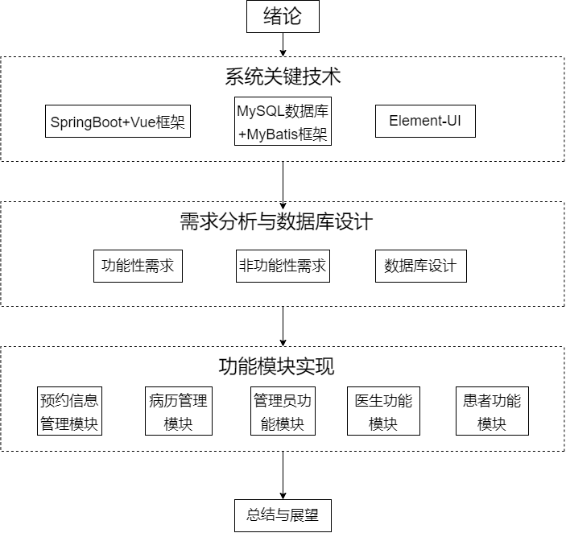

## 三、技术架构图

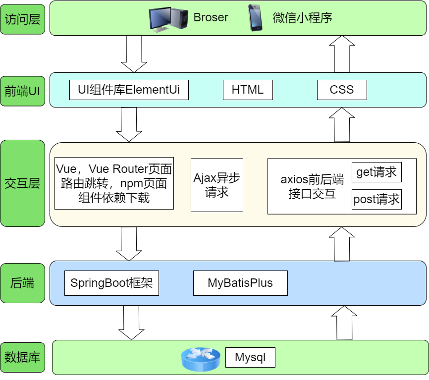

## 四、效果演示

首先，管理员在Web登陆页面使用管理员账号登录，经过身份验证后才会授权使用智能医疗系统，如图5.6所示。

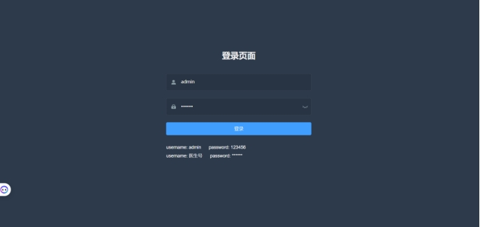 

图5.6 管理员登陆页面

### 医生信息管理

管理员可以浏览所有医生信息，并且可以通过姓名进行搜索。当医院有新入职的医生时可以通过管理员身份进行医生的一个添加注册，并且只有管理员才有权限注册和删除医生的信息。新增医生弹框如图5.8所示，搜索和删除功能的演示不作赘述。

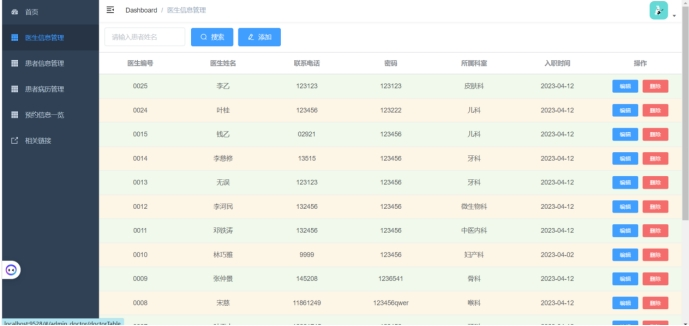

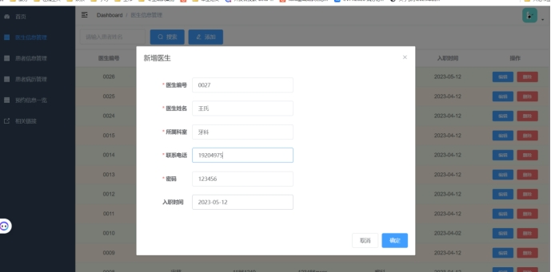 

### 患者信息管理

与医生信息管理功能类似，管理员可以浏览、搜索和编辑患者信息，出于安全考虑，即便管理员也无权对患者信息进行删除操作。

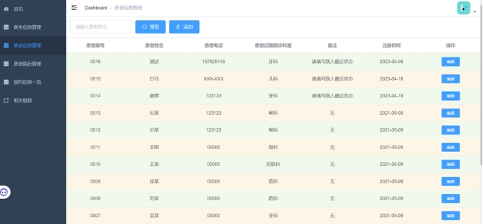 

### 患者病历管理

病历管理页面采用和患者信息管理与医生信息管理完全不同的色彩风格，目的是为了降低管理员的视觉疲劳以防出现系统的误操作引起不可挽回的错误。管理员同样可以通过患者的姓名查到属于某个患者的所有病历，在某些特殊情况下，可以通过管理员角色对病历进行编辑和删除操作。

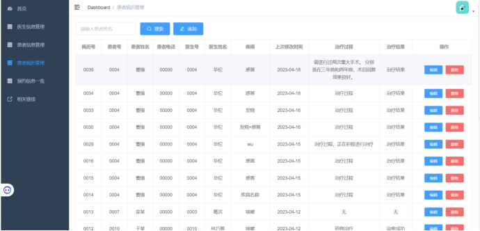 

图5.10 病历管理页面

###  预约信息管理

，管理员可以通过该页面查看系统中所有的预约信息，和预约的状态，并可以通过对患者姓名进行精准搜索。在某些特殊情况下也提供给管理员删除预约的一个功能。

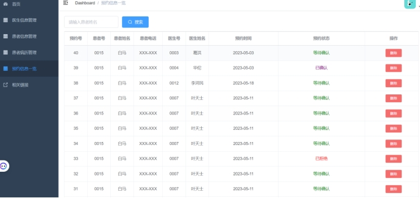

###  医生功能模块 

医生将自己唯一的医生号作为身份标识，通过输入密码进行身份验证，若验证成功后台会返回浏览器一个token令牌，医生凭此进入智慧医疗系统。

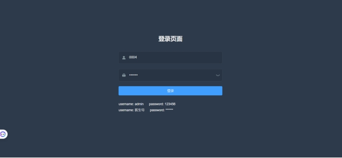 

### 患者模块

医生可以通过系统查看属于其负责的患者的信息，并可以对患者的信息进行编辑，但仅有权限修改患者的最近就诊诊室、联系电话和其对应的备注信息，如图5.14所示。

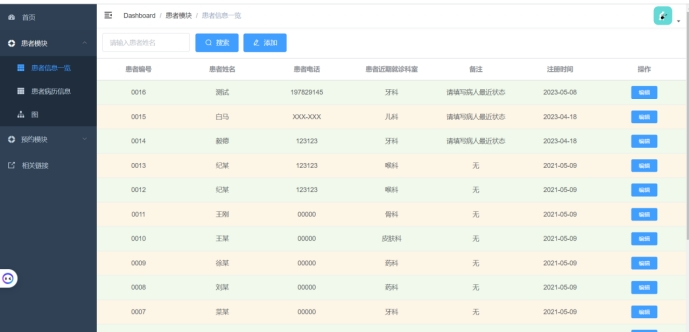 

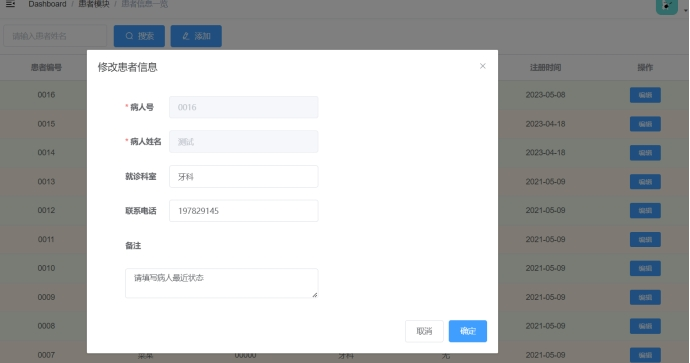 

诊治医生可以通过姓名搜索其所要诊疗的患者的病历，并通过查看其病历信息掌握病情发展情况，并以此为根据得到更为有效合理的后续治疗方案。并且诊治医生可以继续在治疗过程一览中根据事实情况填写其治疗情况，和其对应的治疗结果。

 

###  预约模块

医生可以通过该页面查看其所负责的预约信息情况，医生可以根据实际情况选择接受预约或者拒绝预约。医生还可以在后面三栏中，分别查看已确认预约、已完成预约和拒绝预约的情况，在此不再过多赘述。

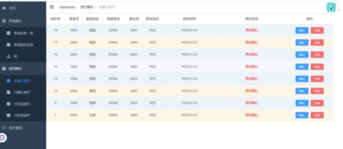 
